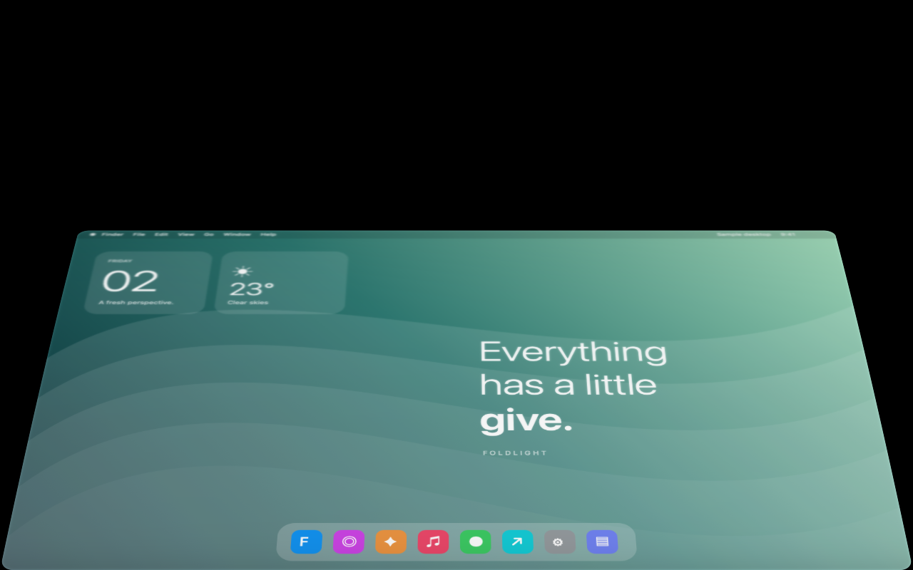

# Foldlight

A small macOS menu bar app that folds your desktop as you lower your MacBook lid. Open the lid and the effect reverses.



The animation uses a gently curved surface, smooth blur, rounded edges, subtle reflections, and soft hinge shadows. Motion follows the lid without bouncing, and rendering follows the display refresh rate, up to 120 fps on supported screens.

[Watch the sample animation](https://github.com/leotsuka1/Foldlight/releases/download/v1.1.1/Animation.mp4) · [Download the latest app](https://github.com/leotsuka1/Foldlight/releases/latest)

## Install

1. Download **Foldlight-1.1.1.zip** from the latest release and unzip it.
2. Move **Foldlight.app** to your Applications folder and open it.
3. Try **Preview the fold** for an eight-second sample animation.
4. Allow Foldlight in **System Settings → Privacy & Security → Screen & System Audio Recording**, then quit and reopen it if macOS asks.
5. Keep **Respond to the lid** enabled. Slowly lower your lid below the configured angle to see your desktop fold. The default threshold is 100°; choose a value below your usual working angle.

The menu bar icon provides Pause, Preview, Settings, and Quit. Closing the settings window leaves the effect running in the menu bar. Closing the lid still lets macOS sleep normally.

## Requirements

- macOS 14 or newer, Metal, and a MacBook with a readable lid-angle sensor.
- Screen recording permission for the live desktop effect. The sample preview works without it.
- The release binary is for Apple Silicon, signed locally, and is not notarized. Other Macs may require building from source and approving the app in macOS settings.

## Privacy

Desktop frames stay in memory. Foldlight records no audio, saves no desktop screenshots, and makes no network requests. Capture runs near the folding threshold and explicitly excludes Foldlight's own windows. It refuses to start if the animation window cannot be excluded.

Settings are saved locally. The app does not run at login or change sleep settings. An unavailable lid sensor disables the live effect; the sample preview remains available.

## Build

Install Apple's command-line developer tools, then run:

```sh
cd Source
zsh scripts/build.sh
```

This creates **Foldlight.app** in the repository root. There are no third-party package dependencies.

## Verify

From the repository root:

```sh
Foldlight.app/Contents/MacOS/Foldlight --self-test
Foldlight.app/Contents/MacOS/Foldlight --sensor-check
```

With screen recording permission and a built-in display, the live regression check briefly shows a colored animation marker and confirms that it never appears in the capture stream, including after capture restarts with settings closed:

```sh
Foldlight.app/Contents/MacOS/Foldlight --capture-regression
```

Additional commands: `--render-check <folder>`, `--export-preview <path.mp4>`.

## Release 1.1.1

Fixes recursive screen capture when the settings window is closed. The animation window is registered before capture, excluded by its window ID, and stale capture callbacks are ignored after a stream restarts. Automated motion, rendering, and exclusion checks pass; the live closed-settings capture check passes on the development Mac. Hardware compatibility and physical lid behavior depend on the Mac.

## Credits

Original implementation using Apple's [ScreenCaptureKit](https://developer.apple.com/documentation/screencapturekit/capturing-screen-content-in-macos) and Metal. Lid sensor protocol reference: [samhenrigold/LidAngleSensor](https://github.com/samhenrigold/LidAngleSensor). Visual inspiration: [the folding desktop video](https://www.youtube.com/watch?v=u1upGj9W7jA).
